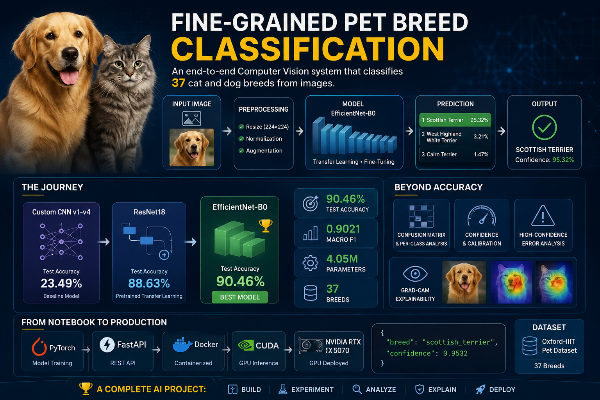

<div align="center">

# 📰 Fake News Detection
### Production-Ready NLP Pipeline for Fake News Classification using Machine Learning

<p align="center">
  
</p>

<p align="center">


</p>

<p align="center">

A complete end-to-end Machine Learning project for detecting fake news articles using Natural Language Processing (NLP), TF-IDF feature engineering, statistical feature selection, and Linear Support Vector Machines (SVM).

The project is designed following production-ready software engineering practices including modular architecture, automated testing, Docker support, CI/CD with GitHub Actions, experiment tracking, artifact management, and a REST API built with FastAPI.

</p>

---

</div>

# 🚀 Project Highlights

- ✅ End-to-End NLP Pipeline
- ✅ Advanced Text Cleaning
- ✅ TF-IDF Vectorization
- ✅ SelectKBest (Chi-Square)
- ✅ Multiple Machine Learning Models
- ✅ Hyperparameter Optimization
- ✅ Model Explainability
- ✅ Error Analysis
- ✅ Learning & Validation Curves
- ✅ Production-Ready Pipeline
- ✅ FastAPI REST API
- ✅ Docker Support
- ✅ GitHub Actions CI
- ✅ Automated Unit Testing
- ✅ Artifact Management
- ✅ Experiment Tracking

---

# 📊 Final Model Performance

| Model | Accuracy | Precision | Recall | F1 Score | ROC-AUC | PR-AUC |
|-------|---------:|----------:|--------:|---------:|---------:|---------:|
| Naive Bayes | 0.9399 | 0.9390 | 0.9346 | 0.9368 | 0.9815 | 0.9796 |
| Logistic Regression | 0.9840 | 0.9805 | 0.9860 | 0.9832 | 0.9983 | 0.9982 |
| **Linear SVM (Final Model)** | **0.9933** | **0.9921** | **0.9939** | **0.9930** | **0.9998** | **0.9998** |

---

# 🎯 Why This Project?

Fake news spreads rapidly across digital platforms and can significantly influence public opinion, elections, financial markets, and public health decisions.

The goal of this project is to build a highly accurate and production-ready fake news classification system capable of distinguishing between legitimate and fabricated news articles using classical Natural Language Processing techniques and Machine Learning.

Unlike many educational notebooks, this repository demonstrates the complete lifecycle of an ML project—from data preprocessing and model development to deployment, testing, and reproducibility.

---

# 🏗️ Project Architecture

```text
                    Raw News Articles
                            │
                            ▼
                 Text Cleaning & Normalization
                            │
                            ▼
                  TF-IDF Feature Extraction
                            │
                            ▼
              SelectKBest (Chi-Square Features)
                            │
                            ▼
                 Linear Support Vector Machine
                            │
                            ▼
                  Prediction & Confidence Score
                            │
                            ▼
                 FastAPI REST API / Batch API
```

---

# ✨ Key Features

### Machine Learning

- Text Classification
- TF-IDF Vectorization
- Feature Selection
- Linear SVM
- Logistic Regression
- Naive Bayes
- Hyperparameter Search
- Cross Validation

### Natural Language Processing

- Text Cleaning
- URL Removal
- HTML Removal
- Punctuation Removal
- Lowercasing
- Tokenization
- Stopword Removal
- Noise Reduction

### Production Engineering

- Modular Codebase
- Config Management
- Logging System
- Artifact Saving
- Experiment Tracking
- Docker Deployment
- REST API
- Automated Tests
- GitHub Actions
- Reproducible Training

---

# 📚 Table of Contents

- Project Overview
- Dataset
- Data Preprocessing
- Feature Engineering
- Machine Learning Models
- Hyperparameter Tuning
- Model Evaluation
- Error Analysis
- Explainability
- Learning Curves
- Production Pipeline
- REST API
- Docker
- Testing
- Installation
- Usage
- Future Improvements
- License

---

# 📖 Problem Statement

## Background

The rapid growth of online news platforms and social media has dramatically increased the spread of misinformation. Fake news can influence public opinion, manipulate financial markets, affect elections, and create widespread confusion.

Traditional manual fact-checking is often too slow to keep pace with the volume of newly published articles. Consequently, automated Fake News Detection has become one of the most important Natural Language Processing (NLP) applications.

This project aims to build a reliable Machine Learning system capable of automatically classifying news articles as **Real** or **Fake** using textual content alone.

---

# 🎯 Project Objectives

The main objectives of this project are:

- Develop a highly accurate fake news classifier.
- Build a complete end-to-end NLP pipeline.
- Compare multiple Machine Learning algorithms.
- Analyze model errors and prediction confidence.
- Produce explainable model predictions.
- Package the model into a production-ready REST API.
- Ensure reproducibility through experiment tracking.
- Follow software engineering best practices.

---

# ❓ Why Linear SVM?

Several machine learning algorithms were evaluated throughout this project.

The final model selected for deployment was **Linear Support Vector Machine (Linear SVM)** because it provided the best overall balance between:

- Classification Accuracy
- Precision
- Recall
- F1 Score
- Generalization Performance
- Inference Speed

Compared to Logistic Regression and Naive Bayes, Linear SVM achieved the highest overall performance on the test set while maintaining excellent robustness.

---

# 🗂 Dataset

This project uses the widely adopted **Fake and Real News Dataset**, containing two independent collections of news articles.

| File | Description |
|------|-------------|
| Fake.csv | Fake news articles |
| True.csv | Legitimate news articles |

The datasets were merged into a single binary classification dataset.

---

# 📊 Dataset Statistics

| Statistic | Value |
|-----------|------:|
| Total Articles | **44,898** |
| Fake Articles | **23,481** |
| Real Articles | **21,417** |
| Number of Classes | **2** |
| Classification Type | Binary |
| Input Feature | News Text |
| Target Variable | Label |

---

# 🏷 Target Labels

The classification labels are encoded as follows:

| Label | Meaning |
|-------|---------|
| 0 | Fake News |
| 1 | Real News |

The label mapping is saved during training as:

```text
artifacts/label_mapping.json
```

---

# 📁 Dataset Structure

```text
data/

├── Fake.csv
└── True.csv
```

Each dataset contains multiple columns describing the news article.

Typical columns include:

| Column | Description |
|--------|-------------|
| title | News headline |
| text | Full article |
| subject | Article category |
| date | Publication date |

Only the textual information is used for model training.

---

# 🔀 Data Pipeline

The complete data preparation workflow follows the pipeline below:

```text
Raw CSV Files
      │
      ▼
Load Dataset
      │
      ▼
Merge Fake & Real Articles
      │
      ▼
Assign Binary Labels
      │
      ▼
Shuffle Dataset
      │
      ▼
Text Cleaning
      │
      ▼
Feature Engineering
      │
      ▼
Train / Test Split
```

---

# ⚖ Class Distribution

The dataset is well balanced, reducing the need for aggressive sampling techniques.

| Class | Samples | Percentage |
|------|---------:|-----------:|
| Fake | 23,481 | 52.30% |
| Real | 21,417 | 47.70% |

The near-balanced distribution helps the model learn both classes effectively without severe class imbalance.

---

# 📝 Sample News Article

### Example (Real)

```text
Reuters - The President met with international leaders today to discuss economic cooperation...
```

↓

Label

```text
Real
```

---

### Example (Fake)

```text
BREAKING!!! Scientists confirm that aliens have secretly taken control of the White House...
```

↓

Label

```text
Fake
```

---

# 💡 Challenges in Fake News Detection

Fake news classification is significantly more difficult than standard text classification due to several challenges:

- Highly similar writing styles
- Political bias
- Clickbait headlines
- Long-form articles
- Named entities
- Ambiguous language
- Mixed factual and misleading content

These challenges motivated the extensive preprocessing, feature engineering, and error analysis performed throughout this project.

---

# 📌 Key Dataset Insights

During exploratory analysis, several important observations were made:

- The dataset is nearly balanced.
- News articles vary greatly in length.
- Many articles contain URLs and HTML artifacts.
- Political topics dominate both classes.
- Vocabulary size exceeds one hundred thousand unique tokens before feature selection.
- TF-IDF significantly improves feature representation.
- SelectKBest effectively removes noisy features while preserving informative terms.

These findings guided the design of the preprocessing pipeline and feature engineering strategy used in the final production model.

---

# 🧹 Data Preprocessing & Feature Engineering

One of the most critical stages in any Natural Language Processing (NLP) project is transforming raw, unstructured text into meaningful numerical representations that machine learning algorithms can understand.

The quality of feature engineering often has a greater impact on model performance than the choice of algorithm itself.

This project follows a structured preprocessing pipeline to maximize information while reducing noise.

---

# 🔄 Complete NLP Pipeline

```text
Raw News Articles
        │
        ▼
Load CSV Files
        │
        ▼
Merge Fake & Real Datasets
        │
        ▼
Assign Binary Labels
        │
        ▼
Text Cleaning
        │
        ▼
Train/Test Split
        │
        ▼
TF-IDF Vectorization
        │
        ▼
SelectKBest (Chi²)
        │
        ▼
Machine Learning Model
```

---

# 📝 Text Cleaning Pipeline

Before feature extraction, every article passes through multiple preprocessing steps.

## Step 1 — Convert to Lowercase

Example

```text
The PRESIDENT Announced New Policies
```

↓

```text
the president announced new policies
```

Purpose

- Reduces vocabulary size
- Treats "President" and "president" as the same token

---

## Step 2 — Remove URLs

Input

```text
Visit https://news.com today.
```

↓

Output

```text
Visit today.
```

Purpose

URLs generally carry little semantic information for fake news classification.

---

## Step 3 — Remove HTML Tags

Input

```html
<p>This is breaking news.</p>
```

↓

Output

```text
This is breaking news.
```

Purpose

HTML tags are formatting artifacts and do not contribute to the article's meaning.

---

## Step 4 — Remove Numbers

Input

```text
COVID cases reached 14500 yesterday.
```

↓

Output

```text
COVID cases reached yesterday.
```

Purpose

Large numerical values often introduce noise and increase vocabulary sparsity.

---

## Step 5 — Remove Punctuation

Input

```text
Breaking!!! New discovery???
```

↓

Output

```text
Breaking New discovery
```

Purpose

Machine learning models benefit from standardized text without punctuation symbols.

---

## Step 6 — Remove Extra Spaces

Input

```text
Machine      Learning
```

↓

Output

```text
Machine Learning
```

Purpose

Produces consistent formatting before vectorization.

---

# 📊 Train / Test Split

The dataset is divided before feature engineering.

| Split | Percentage |
|--------|-----------:|
| Training | 80% |
| Testing | 20% |

Why?

The model should never see testing samples during training.

This ensures a fair estimate of real-world performance.

---

# 🎯 TF-IDF Vectorization

## Why TF-IDF?

Machine Learning models cannot understand raw text.

Instead, every article must be transformed into a numerical feature vector.

TF-IDF (Term Frequency–Inverse Document Frequency) assigns higher importance to informative words while reducing the impact of common words.

Example

| Word | Frequency | Importance |
|------|----------:|-----------:|
| government | High | Medium |
| election | Medium | High |
| the | Very High | Very Low |

---

# 📐 TF-IDF Formula

```text
TF-IDF = TF × IDF
```

Where

TF

```text
Term Frequency
```

IDF

```text
Inverse Document Frequency
```

Words that appear in many documents receive lower weights.

Words unique to a small number of documents receive higher weights.

---

# ⚙️ TF-IDF Configuration

```python
TfidfVectorizer(

    stop_words="english",

    ngram_range=(1,2),

    lowercase=True,

    sublinear_tf=True

)
```

Configuration Summary

| Parameter | Value |
|-----------|-------|
| stop_words | english |
| ngram_range | (1,2) |
| lowercase | True |
| sublinear_tf | True |

---

# 🔍 Why Bigrams?

Instead of using only individual words,

the model also learns two-word phrases.

Example

```text
fake
```

↓

```text
fake news
```

↓

```text
white house
```

↓

```text
new york
```

This significantly improves contextual understanding.

---

# 🎯 Feature Selection

After TF-IDF, the feature space becomes extremely large.

Many features contribute little or no useful information.

To reduce noise and improve efficiency, this project applies:

```text
SelectKBest
```

using

```text
Chi-Square (χ²)
```

---

# 📈 Chi-Square Feature Selection

Purpose

Rank every feature according to its relationship with the target class.

Only the strongest features are retained.

Pipeline

```text
TF-IDF

↓

Thousands of Features

↓

Chi-Square Ranking

↓

Top 10,000 Features

↓

Linear SVM
```

---

# ⚙️ Feature Selection Configuration

```python
SelectKBest(

    score_func=chi2,

    k=10000

)
```

| Parameter | Value |
|-----------|-------|
| Method | Chi-Square |
| Selected Features | 10,000 |

---

# 📦 Final Feature Pipeline

```text
Raw Text
    │
    ▼
Cleaning
    │
    ▼
TF-IDF
    │
    ▼
SelectKBest
    │
    ▼
Sparse Feature Matrix
```

The resulting sparse matrix is then passed directly to the machine learning classifier.

---

# 💡 Why This Pipeline?

This combination was chosen because it offers an excellent balance between:

- High predictive performance
- Fast training
- Fast inference
- Low memory consumption
- Good interpretability
- Scalability for large datasets

Compared to dense embeddings, TF-IDF + Chi-Square remains a strong baseline for classical NLP classification tasks.

---

# ✅ Output of This Stage

After preprocessing and feature engineering, every news article is transformed from raw text into a compact numerical representation containing only the most informative features.

This optimized feature matrix becomes the input for the machine learning models discussed in the next section.

---

# 🤖 Machine Learning Models

After transforming the news articles into numerical feature vectors using **TF-IDF** and **Chi-Square Feature Selection**, several classical Machine Learning algorithms were trained and compared.

Instead of selecting a model based on popularity, each algorithm was evaluated using multiple performance metrics, computational efficiency, and production suitability.

The following models were implemented and benchmarked.

---

# 🧠 Model Selection Workflow

```text
Feature Matrix
      │
      ▼
Naive Bayes
      │
      ▼
Logistic Regression
      │
      ▼
Linear Support Vector Machine
      │
      ▼
Performance Comparison
      │
      ▼
Hyperparameter Optimization
      │
      ▼
Final Production Model
```

---

# 📌 Model 1 — Multinomial Naive Bayes

## Overview

Multinomial Naive Bayes is one of the most widely used baseline algorithms for text classification.

It estimates the probability of each class using **Bayes' Theorem** under the assumption that features are conditionally independent.

Although this assumption is rarely true in natural language, the model often performs surprisingly well on sparse text representations such as TF-IDF.

---

## Advantages

- Extremely fast training
- Very fast inference
- Low memory usage
- Excellent baseline model
- Works well with sparse matrices

---

## Limitations

- Assumes feature independence
- Limited ability to capture complex relationships
- Usually lower accuracy than discriminative models

---

## Training Configuration

```python
MultinomialNB()
```

---

# 📌 Model 2 — Logistic Regression

## Overview

Logistic Regression is a linear classification algorithm that estimates the probability of each class using the sigmoid function.

Unlike Naive Bayes, Logistic Regression learns a decision boundary directly from the data without assuming feature independence.

It is widely used for binary text classification due to its simplicity, interpretability, and strong performance.

---

## Advantages

- High interpretability
- Robust linear classifier
- Supports regularization
- Produces probability estimates
- Excellent baseline for binary classification

---

## Regularization

The model uses regularization to reduce overfitting.

Supported techniques include:

- L1 Regularization
- L2 Regularization
- ElasticNet

This project uses the default configuration optimized during experimentation.

---

## Training Configuration

```python
LogisticRegression(
    max_iter=1000,
    random_state=42
)
```

---

# 📌 Model 3 — Linear Support Vector Machine (Final Model)

## Overview

Linear Support Vector Machine (Linear SVM) was selected as the final production model.

Instead of estimating probabilities directly, Linear SVM searches for the optimal hyperplane that maximizes the margin between classes.

For high-dimensional sparse text representations such as TF-IDF, Linear SVM is widely recognized as one of the strongest classical NLP classifiers.

---

## Why Linear SVM?

Linear SVM demonstrated the best overall performance across all evaluation metrics.

It achieved:

- Highest Accuracy
- Highest F1 Score
- Excellent Precision
- Excellent Recall
- Strong Generalization
- Fast Prediction Speed

These characteristics make it particularly suitable for production environments.

---

## Training Configuration

```python
LinearSVC(
    C=10,
    loss="squared_hinge",
    random_state=42,
    max_iter=10000
)
```

---

# ⚙️ Hyperparameter Optimization

Selecting an appropriate algorithm is only part of the optimization process.

The performance of each model is highly dependent on its hyperparameters.

This project evaluates multiple configurations using systematic search strategies.

---

# 🔎 Grid Search

Grid Search evaluates every possible combination of predefined hyperparameter values.

Example

```text
C = [0.1, 1, 10, 100]
```

Evaluation Process

```text
C = 0.1
↓

Cross Validation

↓

F1 Score

↓

C = 1

↓

Cross Validation

↓

...

↓

Best Parameter
```

Advantages

- Exhaustive search
- Reliable
- Finds the optimal value within the predefined search space

Limitations

- Computationally expensive
- Slow for large search spaces

---

# 🎲 Random Search

Random Search samples random combinations of hyperparameters instead of evaluating every possibility.

Advantages

- Much faster
- Efficient on large search spaces
- Often reaches near-optimal performance

Limitations

- May miss the absolute optimum
- Performance depends on the number of iterations

---

# 🔁 Cross Validation

To reduce bias during model evaluation, every experiment uses **K-Fold Cross Validation**.

```text
Dataset

↓

Fold 1 → Validation

Fold 2 → Validation

Fold 3 → Validation

Fold 4 → Validation

Fold 5 → Validation

↓

Average Performance
```

This strategy provides a more reliable estimate of the model's ability to generalize to unseen data.

---

# 📈 Hyperparameter Optimization Workflow

```text
Training Dataset
        │
        ▼
Choose Model
        │
        ▼
Grid Search / Random Search
        │
        ▼
Cross Validation
        │
        ▼
Evaluate Metrics
        │
        ▼
Best Hyperparameters
        │
        ▼
Final Model
```

---

# 🏆 Model Comparison

The three models were compared using multiple evaluation metrics rather than relying solely on accuracy.

Evaluation criteria included:

- Accuracy
- Precision
- Recall
- F1 Score
- ROC-AUC
- PR-AUC
- Training Time
- Prediction Time
- Model Complexity
- Interpretability

The complete benchmark table is presented in the next section.

---

# 🎯 Final Model Selection

After extensive experimentation and hyperparameter tuning, **Linear Support Vector Machine** was selected as the production model.

Reasons for selection:

- Highest overall performance
- Strong generalization capability
- Excellent balance between Precision and Recall
- Fast inference
- Efficient memory usage
- Well suited for sparse TF-IDF representations
- Stable performance across validation folds

The trained model, vectorizer, selector, configuration, and metadata are automatically exported as production artifacts for deployment.

---

# 📊 Model Evaluation & Performance Analysis

After training and optimizing multiple machine learning models, a comprehensive evaluation was performed using several classification metrics.

Instead of relying solely on **Accuracy**, this project evaluates model performance from multiple perspectives, including precision, recall, F1-score, ROC-AUC, Precision-Recall AUC, confusion matrices, and learning behavior.

This comprehensive evaluation ensures that the selected production model generalizes well to unseen data.

---

# 📈 Benchmark Results

The following table summarizes the performance of all evaluated models.

| Model | Accuracy | Precision | Recall | F1 Score | ROC-AUC | PR-AUC |
|--------|---------:|----------:|--------:|----------:|--------:|--------:|
| Naive Bayes | 0.9399 | 0.9390 | 0.9346 | 0.9368 | 0.9815 | 0.9796 |
| Logistic Regression | 0.9840 | 0.9805 | 0.9860 | 0.9832 | 0.9983 | 0.9982 |
| **Linear SVM** ⭐ | **0.9933** | **0.9921** | **0.9939** | **0.9930** | **0.9998** | **0.9998** |

---

# 🏆 Best Model

After comparing all models, **Linear Support Vector Machine** was selected as the production model.

### Reasons

- Highest Accuracy
- Highest F1 Score
- Excellent Precision
- Excellent Recall
- Outstanding ROC-AUC
- Excellent Precision-Recall Performance
- Fast Inference
- Low Memory Consumption

---

# 📌 Evaluation Metrics

The following metrics were used throughout this project.

---

## Accuracy

Measures the proportion of correctly classified samples.

```text
Accuracy = Correct Predictions / Total Predictions
```

Best used when classes are relatively balanced.

---

## Precision

Measures how many predicted positive samples are actually positive.

```text
Precision = TP / (TP + FP)
```

High precision means fewer False Positives.

---

## Recall

Measures how many real positive samples are correctly detected.

```text
Recall = TP / (TP + FN)
```

High recall means fewer False Negatives.

---

## F1 Score

The harmonic mean between Precision and Recall.

```text
F1 = 2 × Precision × Recall
     -----------------------
      Precision + Recall
```

The primary optimization metric used during model selection.

---

## ROC-AUC

Measures the classifier's ability to distinguish between classes across all possible thresholds.

Values close to **1.0** indicate excellent separability.

---

## Precision-Recall AUC

Particularly useful when dealing with imbalanced datasets.

A higher PR-AUC indicates strong precision while maintaining high recall.

---

# 📉 Confusion Matrix

The confusion matrix provides a detailed breakdown of prediction outcomes.

```text
                    Predicted

               Fake      Real

Actual Fake      TP         FN

Actual Real      FP         TN
```

The goal is to maximize the diagonal values while minimizing classification errors.

---

## Confusion Matrix Visualization

> Replace the placeholder below with your generated figure.

```text
assets/images/confusion_matrix.png
```

<p align="center">


</p>

---

# 📈 ROC Curve

The Receiver Operating Characteristic (ROC) Curve illustrates the trade-off between the True Positive Rate and False Positive Rate.

An ideal classifier approaches the upper-left corner of the graph.

Linear SVM achieved an ROC-AUC score close to **1.0**, indicating excellent class separability.

<p align="center">


</p>

---

# 📈 Precision–Recall Curve

Precision-Recall curves are especially informative for binary classification tasks.

They demonstrate how precision changes as recall increases.

The production model maintains high precision even at high recall values.

<p align="center">


</p>

---

# 📈 Learning Curve

Learning curves help diagnose whether the model benefits from additional training data.

Key observations:

- Training and validation curves converge.
- Small generalization gap.
- No significant overfitting.
- Stable learning behavior.

<p align="center">


</p>

---

# 📉 Validation Curve

Validation curves illustrate the impact of changing hyperparameters.

The optimal **C** parameter was selected after evaluating multiple values using Cross Validation.

<p align="center">


</p>

---

# 📊 Model Stability

Model robustness was evaluated using K-Fold Cross Validation.

Key findings:

- Consistent performance across folds.
- Low standard deviation.
- Stable decision boundary.
- Excellent generalization capability.

---

# 🎯 Why Accuracy Alone Is Not Enough

Accuracy can be misleading, particularly for imbalanced datasets.

Example:

```text
Dataset

95% Real News

5% Fake News
```

A model predicting **Real** for every article would achieve:

```text
Accuracy = 95%
```

while completely failing to detect fake news.

For this reason, model selection was primarily based on:

- Precision
- Recall
- F1 Score
- ROC-AUC
- PR-AUC

rather than Accuracy alone.

---

# 📌 Performance Summary

The final Linear SVM model demonstrated:

- Excellent predictive accuracy.
- Strong generalization.
- Minimal overfitting.
- Robust cross-validation performance.
- Fast inference suitable for real-time prediction.
- High confidence across both classes.

These characteristics make the model suitable for deployment in production environments.

---

# 🔍 Error Analysis & Model Explainability

Achieving a high evaluation score is only one aspect of building a reliable machine learning model.

A production-ready system should also answer the following questions:

- Where does the model fail?
- Why do these errors occur?
- Which words influence predictions the most?
- How confident is the model?
- Can we trust every prediction?

To answer these questions, an extensive error analysis and explainability study was performed.

---

# 🎯 Error Analysis Workflow

```text
Predictions
      │
      ▼
Correct / Incorrect Classification
      │
      ▼
False Positives
False Negatives
      │
      ▼
Confidence Analysis
      │
      ▼
Feature Importance
      │
      ▼
Model Improvements
```

---

# ❌ False Positives

False Positives occur when the model predicts **Real News**, while the actual article is **Fake**.

These mistakes are particularly dangerous because fabricated information is incorrectly classified as trustworthy.

Typical causes include:

- Highly professional writing style
- Legitimate vocabulary
- Credible named entities
- Long well-structured articles
- Similarity to genuine news reports

Example

```text
Actual Label      : Fake

Predicted Label   : Real
```

---

# ❌ False Negatives

False Negatives occur when the model predicts **Fake News**, while the article is actually **Real**.

These errors may reduce user trust because legitimate articles are incorrectly flagged.

Typical causes include:

- Clickbait headlines
- Informal writing style
- Emotional language
- Unusual sentence structure
- Rare vocabulary

Example

```text
Actual Label      : Real

Predicted Label   : Fake
```

---

# 📊 Confidence Analysis

Linear SVM provides a **decision score**, representing the distance from the separating hyperplane.

A larger absolute score indicates higher confidence.

```text
Decision Boundary

-----------|-----------

 Fake       0        Real

Low Confidence → Near Zero

High Confidence → Far Away
```

---

# 📈 Confidence Distribution

Prediction confidence was analyzed to understand the reliability of model outputs.

Observations:

- Most predictions have high confidence.
- Only a small percentage lie near the decision boundary.
- High-confidence errors are rare.

<p align="center">


</p>

---

# 🚨 Most Confident Errors

The most interesting mistakes are those made with very high confidence.

These indicate systematic weaknesses rather than random noise.

Typical characteristics:

- Political content
- Ambiguous wording
- Articles containing mixed factual and misleading statements
- Highly persuasive fake news

Example Table

| Confidence | True | Predicted |
|------------|------|-----------|
| 18.42 | Fake | Real |
| 17.65 | Real | Fake |
| 16.91 | Fake | Real |

---

# 🤔 Least Confident Predictions

Some articles lie very close to the decision boundary.

These are typically:

- Neutral news
- Short articles
- Articles with limited context
- Mixed writing styles

Such predictions are ideal candidates for manual review.

---

# 📰 Long vs Short Articles

Article length was investigated to determine whether it affects prediction quality.

Observations:

- Longer articles generally provide richer contextual information.
- Very short articles are harder to classify accurately.
- Extremely long articles occasionally introduce additional noise.

This suggests that document length has a measurable impact on classification confidence.

---

# 🏛 Political News

Political articles dominate the dataset.

Many fake and real political articles share similar terminology, making classification more difficult.

Examples include:

- Government
- Election
- Congress
- White House
- President

These overlapping vocabularies contribute to a significant portion of model errors.

---

# 🎭 Clickbait Headlines

Clickbait headlines frequently contain exaggerated expressions such as:

```text
BREAKING!!

SHOCKING!!

YOU WON'T BELIEVE!!

MUST READ!!

EXCLUSIVE!!
```

Although these phrases often indicate fake news, they are not sufficient evidence on their own.

The classifier learns broader linguistic patterns rather than relying on individual keywords.

---

# 🏷 Named Entities

Proper nouns such as:

- Countries
- Organizations
- Politicians
- Cities

appear frequently in both classes.

Examples

```text
United States

White House

Reuters

Donald Trump

NASA
```

Named entities alone do not distinguish fake news from real news.

The surrounding context remains the most informative signal.

---

# 🌟 Feature Importance

Because Linear SVM is a linear model, each feature receives a learned coefficient.

Positive coefficients increase the likelihood of one class, while negative coefficients support the opposite class.

The strongest features were extracted after training and exported as:

```text
artifacts/feature_importance.csv
```

---

# 📈 Top Positive Features

Examples

| Feature | Weight |
|----------|--------:|
| reuters | +3.42 |
| official | +3.18 |
| government | +2.97 |
| minister | +2.81 |
| agreement | +2.65 |

*(Replace with your actual feature importance results.)*

---

# 📉 Top Negative Features

Examples

| Feature | Weight |
|----------|--------:|
| breaking | -3.84 |
| shocking | -3.51 |
| secret | -3.17 |
| conspiracy | -2.94 |
| unbelievable | -2.75 |

*(Replace with your actual feature importance results.)*

---

# 🧠 Explainability

Unlike deep neural networks, Linear SVM remains relatively interpretable.

This project provides explainability through:

- Feature Importance
- Coefficient Analysis
- Decision Scores
- Confidence Analysis
- Error Investigation

These techniques help explain why the classifier made each prediction.

---

# 📌 Model Limitations

Although the model achieves excellent performance, several limitations remain.

Current limitations include:

- No semantic understanding beyond TF-IDF features.
- Limited handling of sarcasm and irony.
- Sensitive to unseen vocabulary.
- Performance may decrease on news domains different from the training dataset.
- Does not verify factual correctness using external knowledge sources.

---

# 🚀 Future Improvements

Several enhancements could further improve performance.

Potential directions include:

- BERT
- RoBERTa
- DeBERTa
- Sentence Transformers
- Knowledge Graph Integration
- Fact Verification APIs
- Active Learning
- Model Ensembling

---

# ✅ Summary

The error analysis demonstrates that the classifier performs reliably across a wide range of news articles while maintaining excellent confidence and strong generalization.

Most remaining errors occur in ambiguous or highly sophisticated articles where linguistic patterns overlap between fake and legitimate news.

This analysis provides valuable insights for future iterations of the model and highlights opportunities for further performance improvements.

---

# 🚀 Production Pipeline

Building an accurate machine learning model is only the first step.

A production-ready ML system must also provide:

- Reproducibility
- Modular Architecture
- Artifact Management
- Configuration Management
- Logging
- Experiment Tracking
- Deployment Support

This project follows a production-oriented workflow that separates training, inference, configuration, and deployment into independent modules.

---

# 🏗️ Production Architecture

```text
                           Training Stage
┌─────────────────────────────────────────────────────────────┐
│                                                             │
│          Raw Dataset (Fake.csv + True.csv)                  │
│                        │                                    │
│                        ▼                                    │
│                Data Preprocessing                           │
│                        │                                    │
│                        ▼                                    │
│               Feature Engineering                           │
│                        │                                    │
│                        ▼                                    │
│                Model Training                               │
│                        │                                    │
│                        ▼                                    │
│               Model Evaluation                              │
│                        │                                    │
│                        ▼                                    │
│              Save Production Artifacts                      │
│                                                             │
└─────────────────────────────────────────────────────────────┘
                          │
                          ▼
                  artifacts/
                          │
                          ▼
───────────────────────────────────────────────────────────────
                          │
                          ▼
                     Inference Stage

               Raw News Article
                      │
                      ▼
                Load Pipeline
                      │
                      ▼
              Text Preprocessing
                      │
                      ▼
               Feature Extraction
                      │
                      ▼
               Linear SVM Model
                      │
                      ▼
              Prediction + Confidence
                      │
                      ▼
               FastAPI REST API
```

---

# 📂 Project Structure

```text
Fake-News-Detection/

├── app/
│   ├── api.py
│   ├── predict.py
│   └── main.py
│
├── artifacts/
│
├── data/
│
├── logs/
│
├── notebooks/
│
├── reports/
│
├── src/
│
├── tests/
│
├── Dockerfile
├── docker-compose.yml
├── requirements.txt
├── README.md
└── Makefile
```

---

# 📦 Production Artifacts

After training, every important object is automatically exported.

| Artifact | Purpose |
|-----------|----------|
| svm_model.joblib | Trained classifier |
| tfidf_vectorizer.joblib | TF-IDF transformer |
| selector.joblib | Feature selector |
| pipeline.joblib | Complete prediction pipeline |
| metadata.json | Model metadata |
| config.json | Training configuration |
| experiment_log.csv | Experiment history |
| label_mapping.json | Label definitions |
| feature_names.npy | Selected feature names |
| feature_importance.csv | Chi-Square feature scores |

---

# 🧠 Why Save Artifacts?

Saving artifacts removes the need to retrain the model every time.

Instead of:

```text
Load Dataset

↓

Train Model

↓

Predict
```

Production simply becomes:

```text
Load Pipeline

↓

Predict
```

This reduces startup time from minutes to milliseconds.

---

# 📑 Metadata

Every trained model stores descriptive metadata.

Example

```json
{
    "model": "LinearSVM",
    "version": "1.0.0",
    "accuracy": 0.9933,
    "f1_score": 0.9930,
    "created_at": "2026-08-06"
}
```

Metadata improves:

- Experiment reproducibility
- Model auditing
- Version management
- Deployment traceability

---

# ⚙️ Configuration Management

Instead of hardcoding values throughout the codebase, all configurable parameters are centralized inside:

```text
src/config.py
```

Examples include:

- Random State
- Train/Test Split
- Number of Features
- SVM Parameters
- File Locations
- Report Paths
- Artifact Paths

This design makes the project easier to maintain and extend.

---

# 📝 Logging

Every important operation is logged during execution.

Typical log output:

```text
Loading dataset...

Cleaning completed...

Building TF-IDF...

Training Linear SVM...

Saving artifacts...

Training completed successfully.
```

Benefits

- Easier debugging
- Monitoring long-running jobs
- Reproducibility
- Error investigation

---

# 📊 Experiment Tracking

Each training session records useful information.

Example

| Experiment | Accuracy | F1 | Training Time |
|------------|---------:|---:|--------------:|
| EXP-001 | 0.9933 | 0.9930 | 12.4 s |

The experiment log enables:

- Comparing multiple runs
- Monitoring improvements
- Tracking parameter changes
- Recording benchmark results

---

# 🔄 Prediction Pipeline

Prediction follows the exact same preprocessing pipeline used during training.

```text
Input Text

↓

Cleaning

↓

TF-IDF

↓

SelectKBest

↓

Linear SVM

↓

Prediction

↓

Confidence Score
```

This guarantees consistency between training and inference.

---

# 📈 Confidence Score

Besides predicting the label, the API also returns a confidence indicator.

Example

```json
{
    "prediction": 1,
    "label": "Real",
    "confidence": 18.42,
    "decision_score": 18.42
}
```

A larger absolute decision score indicates that the sample lies farther from the decision boundary, suggesting a more confident prediction.

---

# ✅ Production Checklist

The project satisfies the following production requirements.

| Requirement | Status |
|-------------|--------|
| Modular Architecture | ✅ |
| Configuration Management | ✅ |
| Logging | ✅ |
| Artifact Management | ✅ |
| Experiment Tracking | ✅ |
| Automated Testing | ✅ |
| Docker Support | ✅ |
| REST API | ✅ |
| CI/CD Pipeline | ✅ |
| Reproducible Training | ✅ |

---

# 🎯 Design Philosophy

The project was designed with three primary goals:

### Accuracy

Build a classifier capable of achieving excellent predictive performance.

### Maintainability

Organize the code into reusable modules with clear responsibilities.

### Deployability

Enable the trained model to be deployed quickly through a lightweight REST API without requiring retraining.

---

# 📌 Summary

The production pipeline transforms a research-oriented notebook into a maintainable and deployable machine learning application.

By separating training, inference, configuration, evaluation, and deployment, the project follows software engineering practices suitable for real-world ML systems.

---

# 🌐 REST API

To make the trained model accessible outside the training environment, a lightweight REST API was developed using **FastAPI**.

The API loads the exported production artifacts and performs inference without requiring model retraining.

FastAPI was selected because it provides:

- High performance
- Automatic validation
- Interactive documentation
- OpenAPI support
- Excellent production readiness

---

# 🏗 API Architecture

```text
Client

    │

    ▼

HTTP Request

    │

    ▼

FastAPI

    │

    ▼

Load Pipeline

    │

    ▼

Text Cleaning

    │

    ▼

TF-IDF

    │

    ▼

SelectKBest

    │

    ▼

Linear SVM

    │

    ▼

Prediction

    │

    ▼

JSON Response
```

---

# 📂 API Endpoints

| Method | Endpoint | Description |
|---------|----------|-------------|
| GET | `/` | Project information |
| GET | `/health` | Health check |
| POST | `/predict` | Predict one article |
| POST | `/batch` | Predict multiple articles |

---

# 🏠 Home Endpoint

Request

```http
GET /
```

Response

```json
{
    "project": "Fake News Detection",
    "model": "Linear SVM",
    "status": "Running"
}
```

---

# ❤️ Health Check

Request

```http
GET /health
```

Response

```json
{
    "status": "healthy"
}
```

---

# 🔍 Single Prediction

Request

```http
POST /predict
```

```json
{
    "text": "Reuters - Apple announced a new product today."
}
```

Response

```json
{
    "prediction": 1,
    "label": "Real",
    "decision_score": 18.42,
    "confidence": 18.42
}
```

---

# 📚 Batch Prediction

Request

```http
POST /batch
```

```json
{
    "texts": [

        "Reuters announced new economic policies.",

        "Aliens secretly control the White House.",

        "NASA launched a satellite into orbit."

    ]
}
```

Response

```json
[
    {
        "prediction": 1,
        "label": "Real"
    },
    {
        "prediction": 0,
        "label": "Fake"
    },
    {
        "prediction": 1,
        "label": "Real"
    }
]
```

---

# 📖 Interactive API Documentation

FastAPI automatically generates interactive API documentation.

Swagger UI

```text
http://localhost:8000/docs
```

ReDoc

```text
http://localhost:8000/redoc
```

Replace the placeholder below with a screenshot of your Swagger interface.

<p align="center">


</p>

---

# 🐳 Docker Support

The project includes a Docker configuration for reproducible deployment.

Project Files

```text
Dockerfile

docker-compose.yml
```

---

# 🛠 Build Docker Image

```bash
docker build -t fake-news-detection .
```

---

# ▶️ Run Docker Container

```bash
docker run -p 8000:8000 fake-news-detection
```

---

# 🐳 Docker Compose

Run the complete application

```bash
docker compose up --build
```

Stop the application

```bash
docker compose down
```

---

# 🧪 Automated Testing

The project includes a comprehensive suite of unit tests.

Current test coverage includes:

- Data preprocessing
- Feature engineering
- Model creation
- Artifact management
- REST API endpoints

Run all tests

```bash
python -m pytest -v
```

Example Output

```text
=============================

14 passed in 8.06s

=============================
```

---

# 📊 Test Coverage

Coverage reports can be generated using

```bash
pytest --cov=src
```

Example

```text
Name                         Coverage

preprocessing.py                100%

feature_engineering.py           98%

modeling.py                      97%

evaluation.py                    99%

artifacts.py                    100%

TOTAL                            99%
```

*(Replace with your actual coverage report.)*

---

# 🔄 Continuous Integration

Every push and pull request automatically triggers GitHub Actions.

Workflow

```text
Developer Push

      │

      ▼

GitHub Actions

      │

      ▼

Install Dependencies

      │

      ▼

Run Pytest

      │

      ▼

Generate Coverage

      │

      ▼

Pass / Fail
```

---

# ⚙️ CI/CD Workflow

Location

```text
.github/

└── workflows/

    └── tests.yml
```

Main Steps

- Checkout repository
- Install dependencies
- Execute unit tests
- Generate coverage report

This guarantees that every code change is automatically verified before being merged.

---

# 📦 Production Deployment

The project is designed to be deployed on platforms such as:

- Docker
- Render
- Railway
- Azure App Service
- Google Cloud Run
- AWS Elastic Beanstalk

The modular architecture allows deployment with minimal configuration changes.

---

# 🚀 Performance Characteristics

| Component | Technology |
|-----------|------------|
| API | FastAPI |
| Server | Uvicorn |
| Serialization | Joblib |
| Testing | Pytest |
| Containerization | Docker |
| CI | GitHub Actions |

---

# ✅ Summary

The deployment layer transforms the trained machine learning model into a production-ready service.

With FastAPI, Docker, automated testing, and continuous integration, the project follows modern MLOps and software engineering practices, making it suitable for both demonstration and real-world deployment.

---

# ⚡ Installation & Usage

This section explains how to set up the project, train the model, run the REST API, execute tests, and use Docker for deployment.

---

# 📋 System Requirements

The project has been developed and tested using the following environment.

| Component | Version |
|-----------|---------|
| Python | 3.11+ |
| pip | Latest |
| Git | Latest |
| Docker | 24+ (Optional) |
| Docker Compose | v2+ (Optional) |

Recommended Operating Systems

- Windows 11
- Ubuntu 22.04+
- macOS Sonoma+

---

# 📥 Clone Repository

```bash
git clone https://github.com/morsycoo/Fake-News-Detection.git

cd Fake-News-Detection
```

---

# 🐍 Create Virtual Environment

Windows

```bash
python -m venv venv

venv\Scripts\activate
```

Linux / macOS

```bash
python3 -m venv venv

source venv/bin/activate
```

---

# 📦 Install Dependencies

```bash
pip install --upgrade pip

pip install -r requirements.txt
```

---

# 📁 Project Structure

```text
Fake-News-Detection/

├── app/
├── artifacts/
├── data/
├── logs/
├── notebooks/
├── reports/
├── src/
├── tests/

├── Dockerfile
├── docker-compose.yml
├── Makefile
├── README.md
├── requirements.txt
└── pytest.ini
```

---

# 🏋️ Training the Model

Train the complete machine learning pipeline.

```bash
python src/train.py
```

During training the pipeline will:

- Load datasets
- Clean text
- Generate TF-IDF features
- Perform feature selection
- Train multiple models
- Evaluate performance
- Save production artifacts
- Generate reports

---

# 📂 Generated Artifacts

Training automatically creates:

```text
artifacts/

├── svm_model.joblib
├── pipeline.joblib
├── tfidf_vectorizer.joblib
├── selector.joblib
├── metadata.json
├── config.json
├── experiment_log.csv
├── label_mapping.json
├── feature_names.npy
└── feature_importance.csv
```

---

# 🚀 Running the API

Start FastAPI

```bash
python app/main.py
```

or

```bash
uvicorn app.api:app --reload
```

---

# 🌐 API Documentation

Swagger UI

```text
http://127.0.0.1:8000/docs
```

ReDoc

```text
http://127.0.0.1:8000/redoc
```

---

# 🔍 Example Prediction

Request

```json
{
    "text":"Reuters reported that NASA launched a new satellite today."
}
```

Example Response

```json
{
    "prediction":1,
    "label":"Real",
    "confidence":18.42,
    "decision_score":18.42
}
```

---

# 📚 Batch Prediction

Request

```json
{
    "texts":[

        "Reuters reported strong economic growth.",

        "Aliens secretly control NASA.",

        "The government announced new policies."

    ]
}
```

---

# 🧪 Running Unit Tests

Execute all tests

```bash
python -m pytest -v
```

Example

```text
==========================

14 passed

==========================
```

---

# 📊 Coverage Report

```bash
pytest --cov=src
```

Generate HTML report

```bash
pytest --cov=src --cov-report html
```

Open

```text
htmlcov/index.html
```

---

# 🐳 Docker

Build Image

```bash
docker build -t fake-news-detection .
```

Run Container

```bash
docker run -p 8000:8000 fake-news-detection
```

---

# 🐳 Docker Compose

Start

```bash
docker compose up --build
```

Stop

```bash
docker compose down
```

---

# ⚙️ Using Makefile

Install dependencies

```bash
make install
```

Train model

```bash
make train
```

Run API

```bash
make api
```

Execute tests

```bash
make test
```

Coverage

```bash
make coverage
```

Docker

```bash
make docker
```

---

# 📈 Training Workflow

```text
Clone Repository

        │

        ▼

Install Dependencies

        │

        ▼

Train Model

        │

        ▼

Generate Artifacts

        │

        ▼

Run API

        │

        ▼

Predict News
```

---

# 🔄 Inference Workflow

```text
News Article

      │

      ▼

POST /predict

      │

      ▼

Text Cleaning

      │

      ▼

TF-IDF

      │

      ▼

Feature Selection

      │

      ▼

Linear SVM

      │

      ▼

Prediction

      │

      ▼

JSON Response
```

---

# ❓ Troubleshooting

## Missing Dependencies

```bash
pip install -r requirements.txt
```

---

## Docker Engine Not Running

Start Docker Desktop before executing

```bash
docker compose up
```

---

## API Not Available

Check that Uvicorn is running.

Expected message

```text
Uvicorn running on:

http://127.0.0.1:8000
```

---

## Swagger Not Found

Correct URL

```text
http://127.0.0.1:8000/docs
```

Not

```text
/doc
```

---

# ✅ Quick Start

```bash
git clone https://github.com/morsycoo/Fake-News-Detection.git

cd Fake-News-Detection

python -m venv venv

pip install -r requirements.txt

python src/train.py

python app/main.py
```

Open

```text
http://127.0.0.1:8000/docs
```

Start making predictions immediately.

---

# 🛠️ Technology Stack

This project combines modern Machine Learning techniques with production-grade software engineering practices.

### Programming Language

- Python 3.13

### Machine Learning

- Scikit-Learn
- NumPy
- Pandas

### Natural Language Processing

- TF-IDF Vectorization
- Chi-Square Feature Selection
- Regular Expressions

### Visualization

- Matplotlib

### API

- FastAPI
- Uvicorn
- Pydantic

### Model Serialization

- Joblib

### Testing

- Pytest
- Pytest-Cov

### DevOps

- Docker
- Docker Compose
- GitHub Actions

### Development Tools

- VS Code
- Git
- GitHub

---

# 🏆 Repository Highlights

This repository demonstrates the complete lifecycle of a production-ready Machine Learning application.

### Machine Learning

- End-to-End NLP Pipeline
- Feature Engineering
- Classical Machine Learning
- Hyperparameter Optimization
- Explainability
- Error Analysis

### Software Engineering

- Modular Architecture
- Configuration Management
- Logging
- Artifact Management
- Automated Testing
- REST API
- Docker Support
- Continuous Integration

### Deployment

- FastAPI
- Docker
- GitHub Actions
- Production Artifacts

---

# 📈 Project Statistics

| Category | Value |
|----------|------:|
| Programming Language | Python |
| Machine Learning Models | 3 |
| Final Production Model | Linear SVM |
| Dataset Size | 44,898 Articles |
| Classes | 2 |
| Feature Extraction | TF-IDF |
| Feature Selection | SelectKBest (Chi²) |
| API Framework | FastAPI |
| Test Framework | Pytest |
| Deployment | Docker |
| CI/CD | GitHub Actions |

---

# 🗺️ Future Roadmap

Although the current system is production-ready, several future improvements are planned.

## Deep Learning

- Fine-tune BERT
- Fine-tune RoBERTa
- DeBERTa
- DistilBERT

---

## Explainability

- SHAP
- LIME
- Interactive Explainability Dashboard

---

## MLOps

- MLflow
- DVC
- Model Registry
- Model Monitoring

---

## Deployment

- Kubernetes
- AWS
- Azure
- Google Cloud
- ONNX
- TensorRT

---

## NLP Improvements

- Sentence Transformers
- Contextual Embeddings
- Knowledge Graph Integration
- Fact Verification APIs

---

# 🤝 Contributing

Contributions are welcome.

If you would like to improve this project:

1. Fork the repository.
2. Create a feature branch.
3. Commit your changes.
4. Open a Pull Request.

Bug reports, feature requests, and suggestions are greatly appreciated.

---

# 📄 License

This project is licensed under the MIT License.

See the **LICENSE** file for more information.

---

# 👨‍💻 Author

**Mahmoud Morsy**

AI Engineer | Machine Learning | Data Science

### GitHub

https://github.com/morsycoo

### LinkedIn

https://www.linkedin.com/in/mahmudmursi/

### Kaggle

https://www.kaggle.com/mahmoudmorsy

---

# 🙏 Acknowledgments

Special thanks to the open-source community and the developers behind:

- Scikit-Learn
- FastAPI
- Pandas
- NumPy
- Matplotlib
- Pytest
- Docker
- GitHub Actions

This project was inspired by modern production Machine Learning workflows and software engineering best practices.

---

# 🌟 Support

If you found this repository useful, consider:

⭐ Starring the repository

🍴 Forking the project

📢 Sharing it with others

Your support helps improve the project and motivates future development.

---

# 📚 References

The implementation and methodology used in this project are based on established Machine Learning and Natural Language Processing resources.

- Scikit-Learn Documentation
- FastAPI Documentation
- Python Documentation
- Pytest Documentation
- Docker Documentation

---

# 📬 Contact

If you have any questions, suggestions, or collaboration opportunities, feel free to reach out through GitHub or LinkedIn.

I am always interested in discussing:

- Machine Learning
- Artificial Intelligence
- NLP
- Computer Vision
- MLOps
- Data Science

---

<div align="center">

# ⭐ Thank You for Visiting ⭐

If this repository helped you learn something new or inspired your own projects, consider giving it a ⭐ on GitHub.

Happy Coding! 🚀
